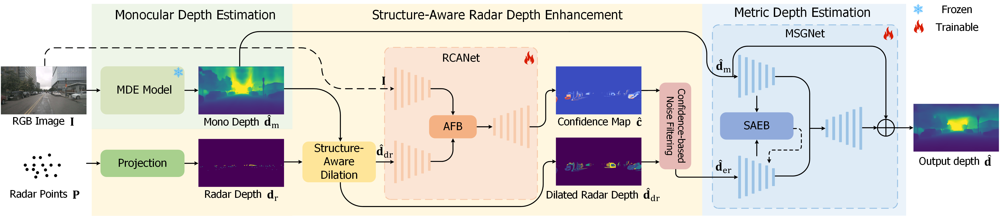
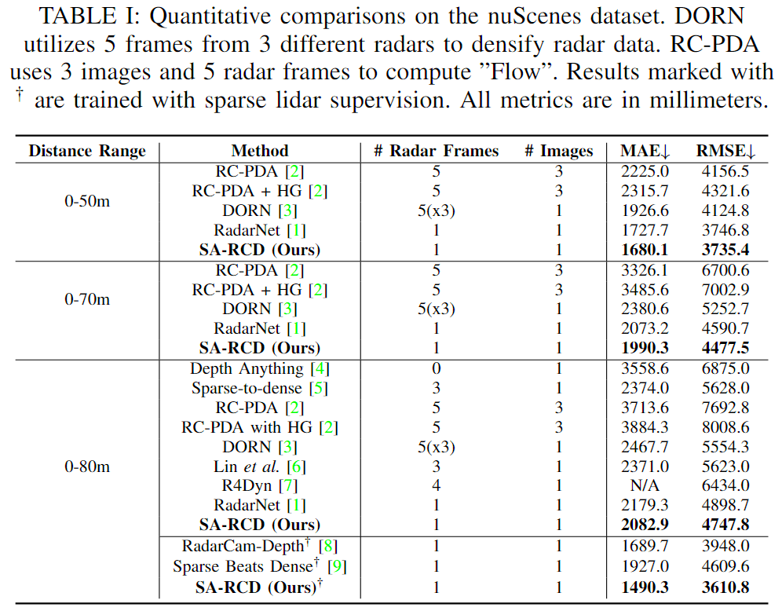

# Structure-Aware Radar-Camera Depth Estimation

## 🚀 News

- **2024.10.07** code released

## Introduction
Radar has gained much attention in autonomous driving due to its accessibility and robustness. However, its standalone application for depth perception is constrained by issues of sparsity and noise. Radar-camera depth estimation offers a more promising complementary solution. Despite significant progress, current approaches fail to produce satisfactory dense depth maps, due to the unsatisfactory processing of the sparse and noisy radar data. They constrain the regions of interest for radar points in rigid rectangular regions, which may introduce unexpected errors and confusions. To address these issues, we develop a structure-aware strategy for radar depth enhancement, which provides more targeted regions of interest by leveraging the structural priors of RGB images. Furthermore, we design a Multi-Scale Structure Guided Network to enhance radar features and preserve detailed structures, achieving accurate and structure-detailed dense metric depth estimation. Building on these, we propose a structure-aware radar-camera depth estimation framework, named SA-RCD. Extensive experiments demonstrate that our SA-RCD achieves state-of-the-art performance on the nuScenes dataset.

## Method

Schematics of the proposed SA-RCD. The framework consists of the monocular depth estimation for capturing structure priors from RGB images, the structure-aware radar depth enhancement for enhancing radar depth in targeted regions, and the metric depth estimation through MSGNet for achieving accurate and structure-detailed metric depth estimation.

## Quantitative Results

## Getting Starteed

- To do

## Pretrained Models

We provide the pretrained weights of RCANet and MSGNet on the nuScenes dataset, reproduced with the released codebase.

[RCANet](https://github.com/FreyZhangYeh/SA-RCD/releases/download/checkpoints/MSGNet-480000.pth)

[MSGNet](https://github.com/FreyZhangYeh/SA-RCD/releases/download/checkpoints/RCANet-870000.pth)